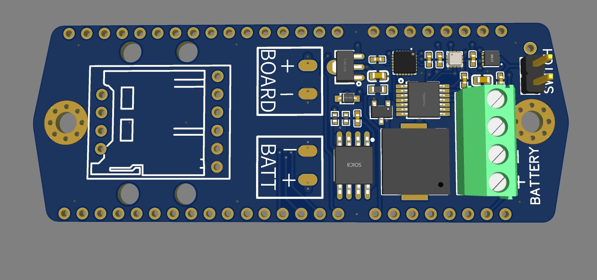
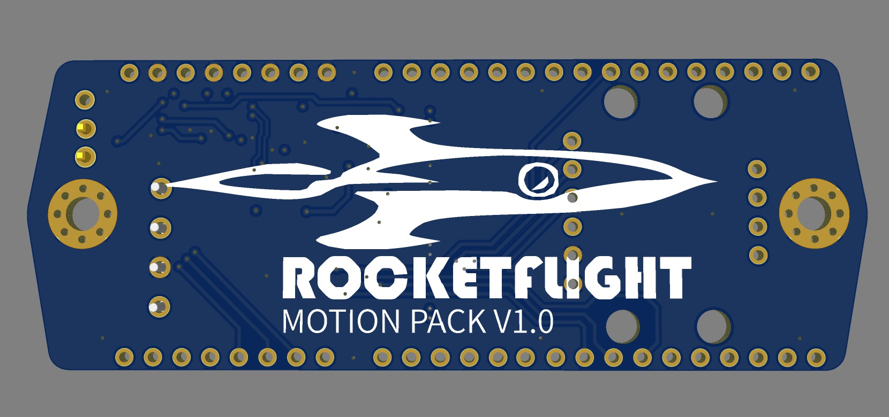

# Motion Pack V1.0

This is an initial prototype to add rocketry sensors to a [Heltec Wireless Tracker Version 1.1](https://heltec.org/project/wireless-tracker/)

> :no_entry: **THIS IS A PROTOTYPE**
> Hardware changes are required following integration test

## Features

The board includes:

- Bosch Sensortec BMP-388 altimeter
- Analog Devices MAX17048 lipo fuel gauge
- TDK InvenSense ICM-20948 -9dof motion processor
- 16Mb SPI NOR RAM
- piezo buzzer
- power and level shifting

### Front

### Back

